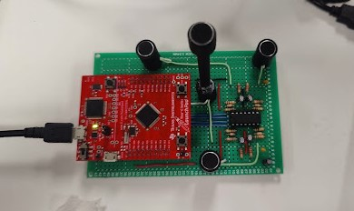

# Table of Contents

1. [Project Background](#i---project-background)
2. [Project Components](#ii---project-components)
   - [Hardware Components](#hardware-components)
   - [Software Components](#software-components)
3. [Approach](#iii---approach)
   - [General Design Considerations](#general-design-considerations)
4. [Implementation](#iv---implementation)
   - [Algorithm for Determining Mic Hits by Arrival of Sound](#algorithm-for-determining-mic-hits-by-arrival-of-sound)
   - [Extraction of Valid Event Data](#extraction-of-valid-event-data)
   - [Definition of a Valid Event](#definition-of-a-valid-event)
   - [Calculation of Theta (θ)](#calculation-of-theta)
5. [Block Diagrams](#v---block-diagrams)
   - [Hardware Block Diagram](#hardware-block-diagram)
   - [Software Block Diagram](#software-block-diagram)
6. [Results and Discussion](#vi---results-and-discussion)

# **I - Project Background**

This project aims to design a low-cost, low-power device that solves the [angle of arrival (AoA)](https://en.wikipedia.org/wiki/Angle_of_arrival) problem from a continuous audio source. The AoA problem takes considerable computational effort, but the aim is to use a very resource-constrained device with limited computational capabilities.

# **II - Project components**

We can divide the project into 2 parts, the hardware circuit–which provides a medium for solving the AoA problem–and the embedded C code that uses a combination of peripherals, registers, and logic to solve for angle of arrival. The software also provides a command interface for more programmability.

## Hardware components

Microphones and conditioning circuits: 3 or 4 electret microphones are used to determine the angle of the noise source in 2 or 3 dimensions. A bias voltage is applied to each microphone to bias the internal FET device. The output is AC coupled to an active half-wave filter and amplifier circuit. The outputs of the 3 or 4 amplifiers (one LM2902 device) are connected to 4 analog microcontroller inputs.

| Part | Use | Quantity |
|------|-----|----------|
| LM2902 (quad op-amp) | Used to amplify the microphone signals | 1   |
| 2.2kΩ, 5% resistor | Used as a mic bias | 4   |
| 1kΩ, 5% resistor | Used in the inverting input of the op-amp. Helps to provide the gain of 100 | 4   |
| 10kΩ, 5% resistor | Shunt input resistors | 4   |
| 100kΩ, 5% resistor | Amplification resistors | 4   |
| 0.1µF capacitor | Supply bypassing to decrease low-frequency noise in 2 out of 4 mics | 2   |
| 1µF capacitor | microphone AC coupler | 4   |
| 10µF capacitor | Supply storage capacitor | 1   |
| 14pin 300mil socket | PDIP socket for LM2902 chip | 1   |
| CMC-9745-44P microphones | Sound detection | 4   |
| Microphone holder (short) | Holds the microphone up without human intervention | 3   |
| Microphone holder (tall) | For the microphone in the middle (for the 3D solution of the problem) | 1   |
| #4 x ¼” sheet metal screw | To hold the microphones to the PC board | 4   |
| 80x120cm FR4 PC board | Circuit board | 1   |

  

  <b>Figure 1: Photo of the project hardware</b>

## Software components

The peripherals used in this project are the DMA, ADC, Digital comparators, timers

| Peripheral | Use |
|------------|-----|
| DMA | Used for continuous data transfer from the ADC to memory |
| ADC | Converts the mic analog data to digital units from 0-4096 |
| Digital comparators | One for each microphone to detect valid events |
| Timer | Timer to stop the DMA after some time after a valid event occurs on one mic so that all the mics have a valid event and not just one. |

# **III - Approach**

The approach to solving the AoA problem is simple. The onboard Analog-to-Digital Converter (ADC) on the Tiva TM4C123GH6PM microcontroller is set up to constantly read microphone data at a 1Msps rate. The μDMA (micro direct memory access) controller is then programmed to continuously read the data storing it in 2 buffers alternating between both buffers so as not to lose any data. This is called pingpong.

## General design considerations

After analyzing the code, some questions may arise about certain design decisions. This is what I hope to answer in this section.

1. Digital comparators were used instead of analog comparators so that low-noise events like everyday speech could be detected.
2. The levels used were around 800-900. The reason that they are hard-coded is because the average system is not implemented yet. When averaging is implemented, a timer goes off once in a while to check the average sound level. It then sets the digital comparator comparison levels to those averages. This creates a more adaptive system.

# **IV - Implementation**

1. Algorithm for Determining Mic Hits by Arrival of Sound:
    - Utilize a Direct Memory Access (DMA) buffer to continuously read sensor data without losing information.
    - Use digital comparators to discern valid sound events from noise based on predefined thresholds, ensuring efficient use of computational resources.
    - Calculate the cross-correlation between pairs of microphone signals to determine the time delay between them.
    - Identify peaks in the cross-correlation function by finding the index with the highest elements.

2. Extraction of Valid Event Data:
    - Extract valid event data by reading values from the DMA buffer, ensuring real-time processing without data loss.
    - Validate the identified events based on consistency across multiple microphones.

3. Definition of a Valid Event:
    - Define a valid event as sensor data read from the ADC that surpasses predefined thresholds set by digital comparators, indicating the presence of a sound of interest.

4. Calculation of Theta (θ):
    - Calculate theta using a polynomial function based on the time differences of arrivals.
    - Use coefficients k1 and k2 obtained from field data by fitting a polynomial function using Python's polyfit function.
    - No other events are triggered until the calculation of theta for the current event is completed.

# **VI - Block Diagrams**

  

  <b>Figure 2: Hardware block diagram</b>

  

  <b>Figure 3: Software Block Diagram</b>

# **VII - Results and Discussion**

Unfortunately, I could not solve for the angle of arrival with good enough accuracy. This is mainly due to 2 factors. I suspect that it was because of incorrectly calibrated k values, and also incorrect index calculation. Next time, I plan to test the modules independently from each other as that would help with debugging. Some other additional steps I could’ve included are:

1. Implement error handling and outlier rejection mechanisms to ensure robustness in real-world scenarios.
2. Apply signal processing techniques for denoising and enhancing the quality of microphone signals before cross-correlation.

  

  <b>Figure 4: Putty screenshot of the project at work</b>

